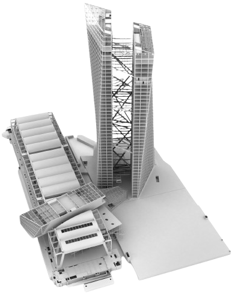

# ECB NMP DeepQNetworks

The ECB manages an extensive and complex real estate portfolio across multiple jurisdictions. Periodically the respective property managers provide a control sheet presenting a global overview of the respective invoices that has been processed throughout the reference period. The CRE team is in charge of initiating the verification workflow and this latter has historically been handled manually, depending on the approach of individual property managers.

